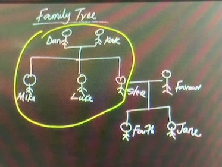
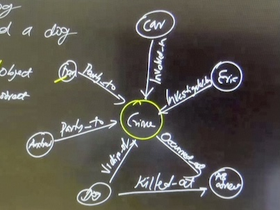
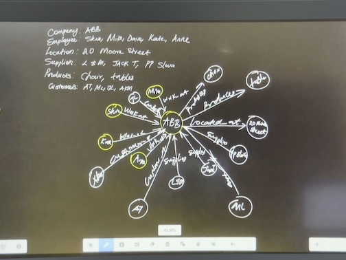

# CREATE CLAUSE IN neo4j

## Creating an Empty Node
It will be created with ID-0 and then ID-1 and so on...
```
create ()
```
## Creating multiple empty Nodes
```
create (), (), (), (), ()
```
### To Check all contents of a database
```
match(n)
return n
```
## Variables in Neo4j
Variable is a name used to refer a neo4j pattern (nodes, relationship etc). But the variable name is not what will be stored in the database.

```
create (n)
return n

create (n), (m), (p), (q), (r), (t)
return m, r // it will create all six nodes but will only return 2
```
To delete all nodes from a database , use the following command
```
match (n) detach delete n
```
## Creating Node with Labels
```
// 'Person' is the label name  and n is the node name
create (n:Person) 
return n

// A same node can belongs to multiple labels
create (anne:Person :Employee :Footballer)
return anne
```
## Creating a Node with Properties
```
// create a node n with multiple properties
create (n{name:"Peter", age:25, email:"p@gmail.com"})
return n
```
## Creating a Node with Properties and Labels
```
// Creating a node with properties belonging to multiple labels
create (n:Person:Dancer{name:"Tony", age:60})
return n
```
## Creating Nodes with Relationships
Relationship cannot exists in isolation unlike nodes
```
// Lets say I have two nodes A and B which have a 'supplied' relationship

// Create the nodes
create (n:Supplier{name:"A"}), (m:Client{name:"B"}),
// Create the relationship
(n) -[r:Supplied]->(m)
// return the query
return n, m, r


// Another way to create the above
create (n:Supplier{name:"A"})-[r:Supplied]->(m:Client{name:"B"})
return n, m, r
```
## Class Asterisk
Represent all the defined variables
```
// returns all the variables without explicitly mentioning it
// If a neo4j pattern does not have a variable name, it will not return it .. * refers to 
// all variable names
create (n:Supplier{name:"A"})-[r:Supplied]->(m:Client{name:"B"})
return * 
```

### EX01 - Using Cypher Model the following
- Peter Married Anne
- Peter Has House

```
create(t:Property{name:"House"})<-[h:Has]-(p:Person{name:"Peter"})-[m:Married]->(a:Person{name:"Anne"})
return *
```
## Class Relationship with Uncommon Characters
- Andrew is the forgotten friend of Mike
- Use the "forgotten friend of" to create a relationship between Andrew and Mike
```
create(n:Person{name:"Andrew"})<-[r:`The forgotten Friend of`]-(m:Person{name:"Mike"})
return *
```
### EX02 - Create the following model
- Tim Follows Kate
- Kate Follows Tim
- Tim Follows John
- John Follows Kate
```
create (t:Person{name:"Tim"}), (k:Person{name:"Kate"}), (j:Person{name:"John"}), (t)-[r1:Follows]->(j), (t)-[r2:Follows]->(k), 
(k)-[r3:Follows]->(t), (j)-[r4:Follows]->(k)
return *

// OR can be also written as 
create (t:Person{name:"Tim"}), (k:Person{name:"Kate"}), (j:Person{name:"John"}),
(k)-[r1:Follows]->(t)-[r2:Follows]->(j)-[r3:Follows]->(k)<-[r4:Follows]-(t)
return *
```
## Creating Paths Variable
A complete neo4j instruction without any commas can be referred as a path and can be assigned and referred by a single variable, called the path variable.
For example
```
create path = (t:Property{name:"House"})<-[h:Has]-(p:Person{name:"Peter"})-[m:Married]->(a:Person{name:"Anne"})
return path
```
### Create the below family tree

```
create (d:Person{name:"Dan"}), (k:Person{name:"Kate"}), 
(m:Person{name:"Mike"}), (l:Person{name:"Luke"}),
(s:Person{name:"Steve"}), (f:Person{name:"Favor"}),
(ft:Person{name:"Faith"}), (j:Person{name:"Jane"}),

(d)-[r1:married_to]->(k)-[r2:married_to]->(d),
(d)-[r3:parent_of]->(m)<-[r4:parent_of]-(k),
(d)-[r5:parent_of]->(l)<-[r6:parent_of]-(k),
(d)-[r7:parent_of]->(s)<-[r8:parent_of]-(k),

(f)-[r9:married_to]->(s)-[r10:married_to]->(f),
(s)-[r11:parent_of]->(ft)<-[r12:parent_of]-(f),
(s)-[r13:parent_of]->(j)<-[r14:parent_of]-(f)
return *
```
### Create for a Crime Investigation as follows
- Suspect - Andrew and Dan
- Victim - Dog
- Crime - Killed a Dog
- Officer - Eric
- Instrument - Car
- Location - 4 AB Street

```
create (d:Suspect{name:"Dan"}), (c:Instrument{name:"Car"}), 
(a:Suspect{name:"Andrew"}), (e:Officer{name:"Eric"}),
(dg:Victim{name:"Dog"}), (addr:Location{name:"AB Street"}),
(cr:Crime{title:"Crime"}),

(d)-[r1:party_to]->(cr)<-[r2:Involved_in]-(c),
(a)-[r3:party_to]->(cr)<-[r4:Investigated_by]-(e),
(dg)-[r5:victim_of]->(cr)-[r6:occured_at]->(addr)<-[r7:killed_at]-(dg)
return *
```
### Create for an Organization as per below

```
create (abb:Comopany{name:"ABB"}), 
(steve:Employee{name:"Steve"}), (mike:Employee{name:"Mike"}), (dave:Employee{name:"Dave"}),
(kate:Employee{name:"Kate"}), (anne:Employee{name:"Anne"}),
(addr:Location{title:"20 Moore Street"}),
(lnm:Supplier{name:"L&M"}), (jackt:Supplier{name:"Jack T"}), (ppslava:Supplier{name:"PP Slava"}),
(chair:Products{name:"Chair"}), (tables:Products{name:"Tables"}),
(at:Customers{name:"AT"}), (ml:Customers{name:"ML"}), (jl:Customers{name:"JL"}), (atom:Customers{name:"Atom"}),

(steve)-[r1:worked_at]->(abb)<-[r2:worked_at]-(mike),
(dave)-[r3:worked_at]->(abb)<-[r4:worked_at]-(kate),
(anne)-[r5:worked_at]->(abb)-[r6:located_at]->(addr),
(lnm)-[r7:supplies]->(abb)<-[r8:supplies]-(jackt),
(ppslava)-[r9:supplies]->(abb),
(chair)<-[r10:produces]-(abb)-[r11:produces]->(tables),
(at)-[r12:customer_of]->(abb)<-[r13:customer_of]-(ml),
(jl)-[r14:customer_of]->(abb)<-[r15:customer_of]-(atom)
return *
```